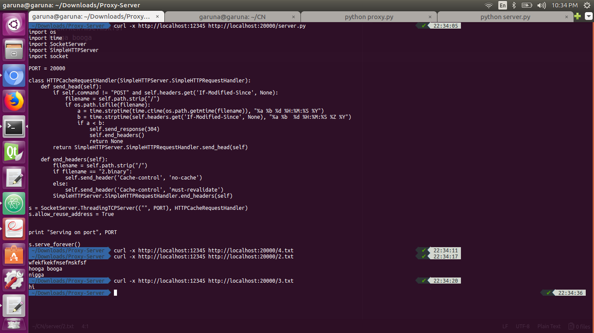

# Assignment 2 - Proxy Server
An HTTP proxy server implemented via python socket programming with caching

## Authors
 * Kushagra Nagori 20161032

## State Diagram for Proxy Server

## Description
- `proxy.py` is the main proxy file
- Proxy runs on some specific ports, some ports are reserved for clients and some for servers
- `.` folder contains the server and the client codes
	- Client keeps asking any file [1-4].data/txt from server by GET or POST method
	- Server listens to specified port and serves any file as asked
- Proxy works as middleman between the server and client and it does caching, authentication, etc
- Only GET requests are handled

## Features
- Receives the request from client and pass it to the server after necessary parsing
- Cache has limited size, so if the cache is full and proxy wants to store another response then it removes the least recently asked cached response. Cache limit can be set by setting up the constant in *proxy.py* file

## How to run

#### Server
- run server in *./server/* directory

- `python server.py` to run server on port 20000

#### Proxy
- run server in *./proxy/* directory

- `python proxy.py` to run proxy server on port 12345

## Screenshots

- Proxy and Server

